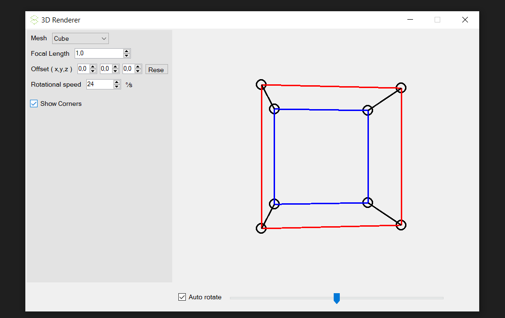
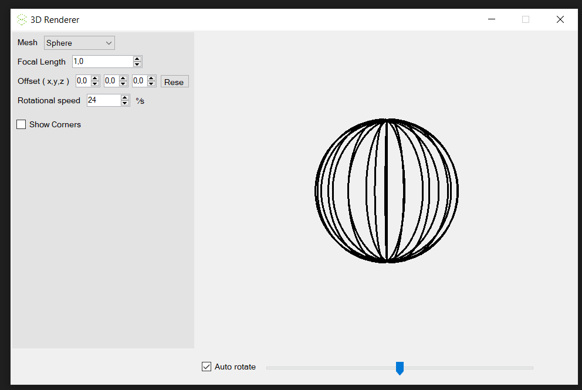

# C# 3D Renderer

## Description
This is my final project for the applied programming course at NTI Gymnasiet, Uppsala. It renders simple 3D objects using C# and Windows Forms and linear algebra.

## Installation
1. Go to the [releases page](https://github.com/viggoStrom/3DRenderer/releases) on GitHub and download the latest release.
2. Run it.

## Building
### Prerequisites
- Visual Studio
- .NET Desktop Environment
    - When cloning the repo and opening it, VS should prompt you to install this if you don't have it.

### Steps
1. Clone the repo.
2. Open the solution file in Visual Studio.
3. Build the solution.